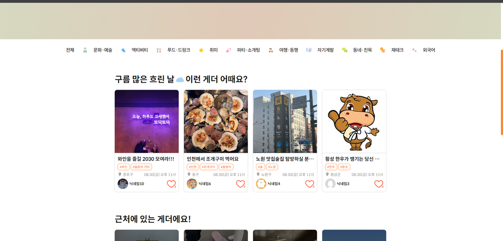
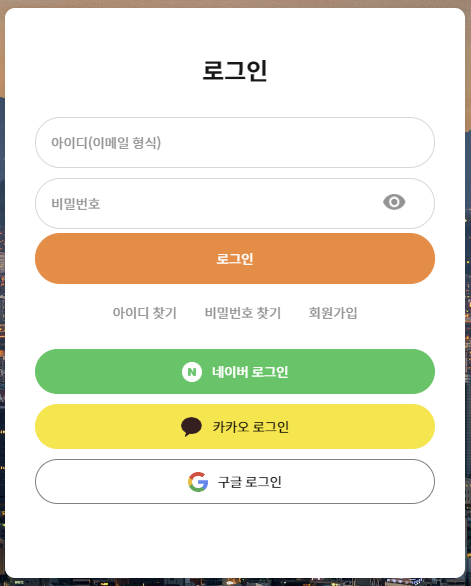
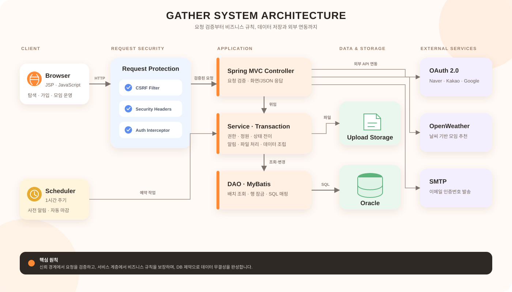

<div align="center">
  
  <h3>취향과 지역, 날씨를 연결해 오늘 함께할 모임을 찾는 커뮤니티</h3>
  <p>
    모임 탐색부터 개설, 참여 승인, 팔로우와 알림까지<br>
    오프라인 모임의 전체 흐름을 하나의 서비스로 구현했습니다.
  </p>
</div>

---

## GATHER 소개

GATHER는 관심사는 같지만 함께할 사람을 찾기 어려운 사용자를 위한 지역 기반 모임 플랫폼입니다. 단순한 게시판에 머무르지 않고 사용자의 취향, 현재 위치, 날씨, 모임 인기도를 탐색 기준으로 활용합니다.

사용자는 이메일 또는 소셜 계정으로 가입하고, 원하는 모임을 검색하거나 직접 개설할 수 있습니다. 모임장은 참여 조건과 승인 방식을 설정하고 신청자를 관리하며, 참여자는 좋아요와 팔로우, 알림을 통해 관심 있는 모임과 사람의 변화를 계속 확인할 수 있습니다.

이 저장소는 기존 기능 구현을 유지하면서 인증, 권한, 동시성, 파일 업로드, XSS, 설정값 관리와 데이터 조회 구조를 다시 점검해 운영 안정성을 강화한 버전입니다.

| 구분 | 내용 |
| --- | --- |
| 서비스 형태 | 취향·지역·날씨 기반 오프라인 모임 커뮤니티 |
| 핵심 사용자 흐름 | 가입 → 모임 탐색 → 개설/참여 → 승인 → 알림 |
| 서버 | Java 11, Spring MVC 5.3, JSP/JSTL |
| 데이터 | Oracle, MyBatis 3.5 |
| 외부 연동 | OpenWeather, Naver·Kakao·Google OAuth, SMTP |
| 실행 환경 | Maven, Tomcat 9, WAR 배포 |

## 담당 영역과 기여

- **데이터 설계**: 포트폴리오 설계 기준 19개 테이블의 관계와 공통 코드 구조를 정리하고, Oracle SQL과 MyBatis 매퍼를 작성했습니다.
- **조회 구조**: 지역·카테고리·인기·취향별 모임 조회와 페이지네이션을 구현하고, 반복 조회를 배치 조회로 바꿨습니다.
- **파일 처리**: 모임 본문의 Base64 이미지를 실제 파일로 분리하는 기능에서 출발해, 형식·크기·해상도 검사와 재인코딩을 포함한 업로드 파이프라인으로 개선했습니다.
- **자동화**: 종료된 모임을 마감하고, 모임 하루 전 참여자에게 알림을 생성하는 스케줄러를 구현했습니다.
- **외부 연동**: Naver·Kakao·Google OAuth, OpenWeather, SMTP 이메일 인증을 서비스 흐름에 연결했습니다.
- **안정성 개선**: 인증·권한·CSRF·XSS·동시성·운영 비밀 관리 문제를 점검하고 서버와 DB 양쪽에 방어 로직을 추가했습니다.

## 주요 화면

### 상황에 맞는 모임 탐색

지역, 인기, 남은 자리, 날씨 조건을 기준으로 모임을 나누어 보여줍니다. 로그인 사용자는 등록한 관심 지역과 취향 데이터를 활용하고, 비로그인 사용자는 브라우저 위치 정보를 기반으로 가까운 모임을 탐색할 수 있습니다.

<p align="center">
  
</p>

### 취향 기반 추천

회원이 선택한 관심 카테고리와 서비스 이용 과정에서 누적된 카테고리 데이터를 이용해 관심 가능성이 높은 모임을 홈 화면에 구성합니다.

<p align="center">
  
</p>

### 가입부터 모임 개설까지

이메일 가입뿐 아니라 Naver, Kakao, Google OAuth 로그인을 지원합니다. 모임 개설 화면에서는 Summernote 편집기, 이미지 첨부, 위치 선택, 연령·성별·인원·승인 조건을 한 번에 설정할 수 있습니다.

<table>
  <tr>
    <th width="38%">소셜 로그인</th>
    <th width="62%">모임 개설</th>
  </tr>
  <tr>
    <td align="center"></td>
    <td align="center"></td>
  </tr>
</table>

### 모임 상세와 참여 관리

이미지 슬라이더와 모임 정보를 함께 제공하며, 참여 신청·재참여·승인·강제 퇴장·마감 같은 상태 변화를 화면에서 처리합니다. 좋아요와 참여 조건 안내도 상세 화면에 통합했습니다.

<p align="center">
  
</p>

## 핵심 기능

### 탐색과 추천

- 지역, 카테고리, 키워드와 인기순 모임 검색
- OpenWeather와 브라우저 위치 정보를 조합한 날씨·위치 기반 추천
- 회원 관심 지역과 취향 카테고리를 활용한 개인화 영역
- 좋아요 수, 남은 자리, 마감 상태가 반영된 모임 카드
- 검색 조건을 유지하는 서버 사이드 페이지네이션

### 회원과 인증

- 이메일 인증번호 발송, 만료 시간, 재요청 제한과 시도 횟수 제한
- Naver, Kakao, Google OAuth 2.0 로그인
- OAuth `state` 검증과 기존 로컬 계정 충돌 방지
- PBKDF2-HMAC-SHA256 비밀번호 저장
- 기존 평문 비밀번호를 정상 로그인 시 안전한 해시로 점진 전환

### 모임 운영

- Summernote 기반 상세 콘텐츠 작성과 이미지 첨부
- 모임 정원, 참여 승인, 연령과 성별 조건 관리
- 방장·참여자 권한에 따른 상태 변경 제한
- 좋아요, 팔로우, 읽음 상태가 있는 알림
- 모임 하루 전 안내와 종료 처리를 수행하는 스케줄러

## 기술적으로 해결한 문제

### 1. 화면에서 숨기는 권한이 아닌 서버가 보장하는 권한

버튼 노출 여부만으로 권한을 구분하면 요청을 직접 만들어 방장 기능이나 다른 사용자의 참여 상태를 변경할 수 있습니다. 모든 상태 변경 요청에서 로그인 사용자와 모임장·참여자 관계를 서버가 다시 확인하도록 만들었습니다.

### 2. 동시에 신청해도 정원을 넘지 않는 참여 처리

정원 확인과 참여 등록 사이에 다른 요청이 끼어들면 초과 참여가 발생할 수 있습니다. 참여 처리 시 모임 행을 잠근 뒤 정원을 확인하고, DB의 `(모임, 사용자)` 유니크 제약으로 중복 참여를 한 번 더 차단했습니다.

### 3. 이미지 파일을 신뢰하지 않는 업로드 파이프라인

파일명과 확장자만 검사하지 않고 실제 이미지 형식, 파일 크기와 해상도를 먼저 확인합니다. 검사를 통과한 이미지는 PNG로 재인코딩해 메타데이터와 비정상 페이로드를 제거하고, 애플리케이션 외부의 영속 저장 경로에 보관합니다.

### 4. 표현력과 XSS 방어를 함께 유지한 본문 처리

모임 소개에는 서식과 이미지가 필요하므로 모든 HTML을 제거할 수 없습니다. OWASP Java HTML Sanitizer의 허용 정책으로 필요한 태그만 보존하고, 일반 텍스트 출력은 JSTL escaping과 `textContent`를 사용해 저장형·반사형 XSS 가능성을 줄였습니다.

### 5. 반복 조회를 배치 조회로 변경

모임 목록을 만든 뒤 카드마다 파일, 작성자, 좋아요 정보를 다시 조회하던 흐름을 ID 묶음 기반 조회로 변경했습니다. 화면 데이터 조립은 서비스 계층에서 담당해 컨트롤러의 책임과 DB 왕복 횟수를 함께 줄였습니다.

### 6. 소스 코드와 운영 비밀의 분리

DB, SMTP, OAuth, 날씨 API와 업로드 경로 설정을 환경 변수로 이동했습니다. 저장소에는 값이 없는 예시 파일만 두어 배포 환경마다 같은 WAR를 사용할 수 있습니다.

## 구조

<p align="center">
  
</p>

```text
src/main/java/com/our/gather
├─ common       공통 조회, 필터, 인터셉터, 파일·보안 유틸
├─ loginPage    로그인과 OAuth 처리
├─ join         회원가입과 이메일 인증
├─ mainPage     검색, 추천과 날씨 프록시
├─ moimGather   모임 개설·수정·참여 상태
├─ notify       알림 생성과 읽음 처리
├─ scheduler    모임 마감과 사전 알림
└─ userPage     프로필, 팔로우와 사용자 활동
```

## 기술 스택

| 영역 | 기술 |
| --- | --- |
| Language | Java 11, JavaScript, HTML5, CSS3 |
| Backend | Spring Framework 5.3.39, Spring MVC, Spring Transaction |
| View | JSP, JSTL, jQuery 3.7.1, Summernote, SweetAlert |
| Persistence | Oracle, MyBatis 3.5.19, MyBatis-Spring 2.1.2 |
| Security | PBKDF2-HMAC-SHA256, CSRF token, security headers, OWASP Java HTML Sanitizer |
| Integration | OpenWeather API, Naver·Kakao·Google OAuth 2.0, JavaMail |
| Build & Runtime | Maven, Tomcat 9, WAR |

## 로컬 빌드와 검증

```bash
mvn clean package
```

현재 자동 검증은 다음을 포함합니다.

- PBKDF2 비밀번호 생성·검증과 기존 비밀번호 전환
- 허용 HTML 보존과 위험한 HTML 제거
- 전체 MyBatis 매퍼 XML 로딩
- Java 11 컴파일과 `ROOT.war` 패키징

최근 확인 결과는 **테스트 4개, 실패 0개**입니다. 생성된 `target/ROOT.war`를 Tomcat 9의 루트 애플리케이션으로 배포할 수 있습니다.

## 배포 전 필수 작업

1. Java 11, Maven, Oracle DB와 Tomcat 9 환경을 준비합니다.
2. [.env.example](.env.example)의 항목을 운영체제 또는 배포 플랫폼의 환경 변수로 등록합니다.
3. [V2__security_hardening.sql](db/migration/V2__security_hardening.sql)을 애플리케이션보다 먼저 운영 DB에 한 번 적용합니다.
4. `GATHER_UPLOAD_DIR`을 영속 볼륨으로 연결하고 애플리케이션에 쓰기 권한을 부여합니다.
5. OAuth 공급자에 `${GATHER_BASE_URL}/gather/{provider}LoginDo.com` 형식의 콜백을 등록합니다.
6. HTTPS 리버스 프록시 뒤에서 서비스하고 세션 쿠키에 `Secure`, `HttpOnly`, `SameSite=Lax` 이상을 적용합니다.

> DB 마이그레이션은 이메일·닉네임·팔로우·좋아요·참여 데이터의 중복을 제약 조건으로 막습니다. 기존 중복 데이터가 있다면 마이그레이션 전에 먼저 정리해야 합니다.

## 설계 선택과 현재 한계

- 현재 저장소는 기존 `javax.servlet` 애플리케이션과 Tomcat 9 호환성을 유지합니다.
- Spring Framework 5.3의 오픈소스 지원은 종료되었습니다. 장기 운영 시 Java 17, Jakarta, Tomcat 10.1과 Spring 6 이상으로의 이전 또는 상용 보안 지원이 필요합니다.
- Oracle, SMTP와 OAuth 공급자를 연결한 통합 테스트 환경은 저장소에 포함되어 있지 않습니다. 배포 전 가입 → 로그인 → 모임 개설 → 참여/승인 → 알림 흐름을 스테이징 환경에서 확인해야 합니다.
- 화면 이미지는 프로젝트 포트폴리오의 실제 구현 화면을 사용했습니다. 이후 보안·운영 개선으로 세부 동작은 현재 코드가 더 강화된 상태입니다.
